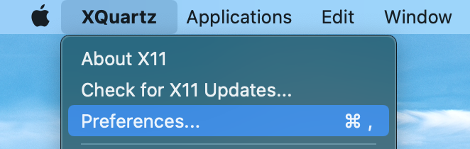
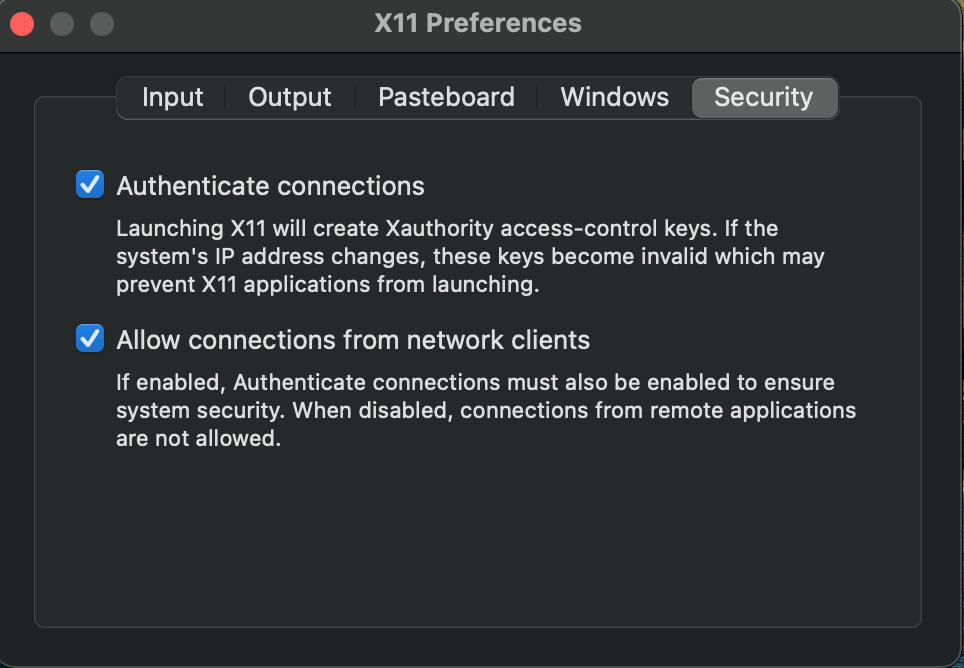
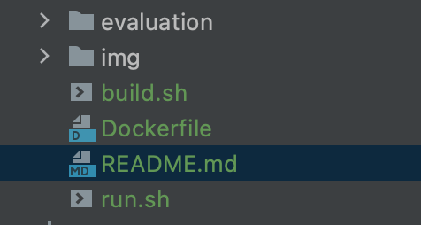

### Running evaLUAtion on MacOS

Based on [this](https://fredrikaverpil.github.io/2016/07/31/docker-for-mac-and-gui-applications/) excellent blog post

## Setup

**This guide assumes that you execute all the commands from the root directory
of this repository.**

1. Install xquartz in order to enable running
GUI applications from a docker container:
    ```shell
    brew install xquartz
   ```
   
2. Open xquartz:
    ```shell
    open -a XQuartz
    ```
   
3. Enable connections from network clients: 
    
    
   
4. Move `evaluation` folder to this directory:
    ```shell
   mv /[path_to_evaLUAtion_src]/evaLUAtion ./evaLUAtion
    ```
   
Expected directory structure:



5.  Build base docker image - Ubuntu with necessary 
libraries:
    ```shell
    chmod +x build.sh
    ./build.sh
    ```
    
6. Run the container with evaLUAtion: 
    ```shell
    chmod +x run.sh
    ./run.sh
    ```

**If you get an error: `Unable to init server: Broadway display type not supported` you
need to reboot your computer. This is an issue with xquartz**

   
7. From now on, you will be executing commands inside 
the docker container. Change directory to `evaluation` 
   and run `evaLUAtion`:
   ```shell
    cd evaluation
   ./evaLUAtion
    ```

8. The window with evaluation will now open.

## Making changes
The `evaluation` directory in this project is mounted to the container,
so you can make changes to your config/scripts, and they will be 
reflected in the container. Once you make changes, run `./evaLUAtion` once again 
from within the container.

## Exiting
`Ctrl+d`. The container should be automatically deleted.
    


